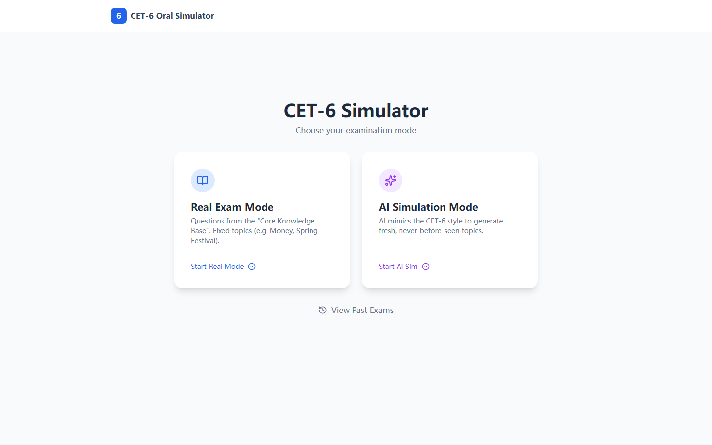

# CET-6 Oral Simulator · 六级口语模拟器

A React + TypeScript mock-exam app for the CET-6 oral test: full 5-part mock exams, part-by-part practice, real-time browser speech recognition, TTS prompts, an AI conversation partner for the pair-discussion part, rubric-based AI scoring, and local history.

六级口语全真模考：完整 5 部分流程、分项练习、浏览器实时语音识别、TTS 考官提示、双人讨论 AI 对话伙伴、按官方评分标准的 AI 三维打分、本地历史记录。

**▶ Live: https://sunnywang666.github.io/cet-6-oral-simulator/** (Chrome recommended for Web Speech API)



## Highlights

- Robust speech capture: stable-prefix commits and refs-over-state to survive the Web Speech API's silent auto-restarts; pause detection feeds a fluency metric / 针对 Web Speech API 自动断流做了稳定性处理，停顿检测参与流利度评分
- Dual AI providers (Zhipu default, Gemini optional) behind one service interface / 双模型供应商可切换
- Scoring follows the official CET-6 oral rubric across three dimensions / 按官方口语评分标准三维打分

## Tech Stack

- React 19
- TypeScript
- Vite
- Tailwind via CDN
- Lucide React icons
- Browser Web Speech API
- Zhipu AI by default, optional Gemini support

## Local Setup

```bash
npm install
cp .env.example .env.local
npm run dev
```

Open `http://localhost:3000`.

## Environment Variables

Create `.env.local` for local development:

```bash
VITE_AI_PROVIDER=zhipu
VITE_ZHIPU_API_KEY=your_zhipu_key
```

Optional Gemini mode:

```bash
VITE_AI_PROVIDER=gemini
VITE_GEMINI_API_KEY=your_gemini_key
```

`VITE_BASE_PATH` defaults to `/`. Only set it when deploying to a subpath:

```bash
VITE_BASE_PATH=/cet-6-oral-simulator/
```

## Scripts

```bash
npm run dev
npm run build
npm run preview
```

## Notes

- Use Chrome for the best Web Speech API support.
- Vite `VITE_*` variables are embedded in client bundles. For a public production app, a backend proxy is safer than putting provider keys in frontend builds.
- The repository intentionally keeps deployment automation minimal. Add server deployment only after the target server and DNS are confirmed.
